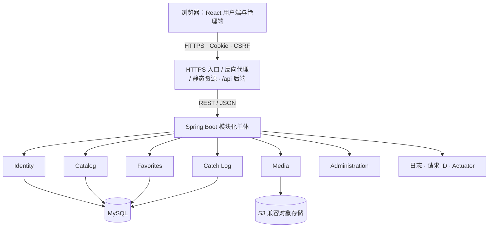
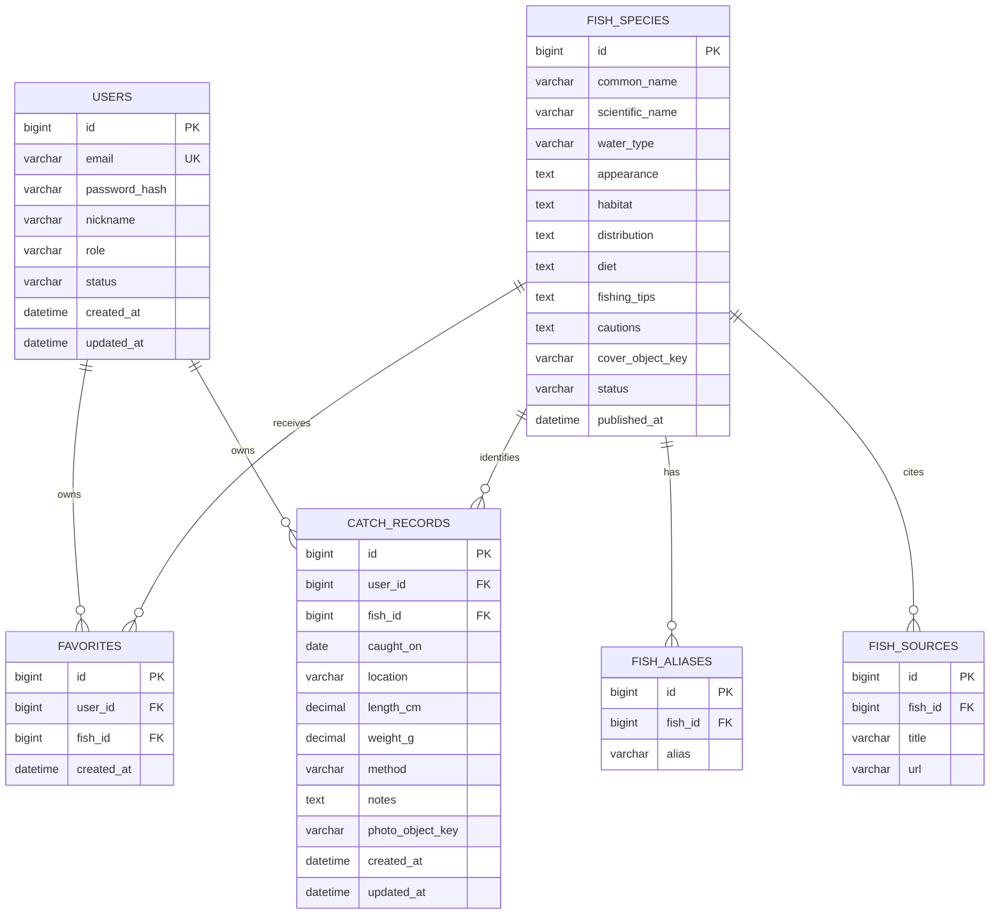

# FishBook MVP 设计规格

- 日期：2026-08-07
- 状态：设计已由用户逐节确认，等待书面规格复核
- 产品形态：响应式 Web 应用
- 目标周期：8–10 周，每周约 10–15 小时

## 1. 项目摘要

FishBook 是面向钓鱼爱好者的个人鱼类知识库与钓获记录工具。第一版通过“查询鱼类 → 阅读资料 → 收藏鱼类 → 实际垂钓 → 记录钓获 → 回顾经验”的闭环，帮助用户集中学习鱼类知识并保存个人垂钓经验。

项目同时承担学习目标：完整实践需求分析、架构设计、前后端开发、关系数据库设计、自动化测试、容器化、CI/CD 和公有云部署。

第一版采用模块化单体，不采用微服务。系统包含一个 React 单页应用、一个 Spring Boot 后端、一个 MySQL 数据库和一个 S3 兼容对象存储。

## 2. 产品定位与目标用户

### 2.1 产品定位

FishBook 第一版定位为“个人鱼类知识库与钓获记录工具”，不是社区、内容开放平台或电商平台。

核心价值：

1. 认鱼和学鱼：查询外形、栖息环境、分布、食性、钓法和注意事项。
2. 记录和复盘：保存自己的钓获照片、鱼种、日期、地点、尺寸、钓法和备注。

### 2.2 目标用户

- 核心用户：有一定经验，希望系统学习鱼类并整理钓获记录的钓鱼爱好者。
- 次要用户：需要结构化入门资料、希望建立目标鱼收藏的新手。
- 管理员：维护公共鱼类资料的内部角色，不是主要消费用户。

### 2.3 非目标

MVP 明确不包含：

- 动态、关注、评论、点赞、私信和通知
- 用户创建公共鱼类条目或内容审核工作流
- AI 图片识鱼
- 地图钓点、精确 GPS、天气、水温、潮汐接口
- 钓具商城、广告、订阅和付费
- 原生 App、微信小程序、多语言
- 多图相册、个人统计仪表盘
- 微服务、消息队列、Redis、Elasticsearch、Kubernetes
- 第三方登录、邮箱验证、忘记密码邮件和账号删除流程

## 3. MVP 成功标准

MVP 以完整闭环和工程质量衡量，不以用户规模衡量。完成时必须满足：

- 用户可以注册、登录、退出并修改昵称。
- 访客可以浏览、搜索、筛选并查看已发布的鱼类资料。
- 用户可以收藏和取消收藏鱼类，并查看个人收藏列表。
- 用户可以创建、查看、修改、删除一张照片的钓获记录。
- 不同用户的私人数据严格隔离。
- 管理员可以创建草稿、编辑、发布和下架鱼类资料。
- 系统通过 HTTPS 在公网上可访问。
- 核心流程具有单元、集成和端到端测试。
- 提交代码后自动执行质量检查、测试和构建；主分支可以自动部署。
- 项目具有需求、架构、API、数据库、测试、部署、备份和恢复文档。

## 4. 功能需求

### 4.1 账号与权限

普通用户使用邮箱和密码注册。邮箱在保存和比较前进行标准化，并具有数据库唯一约束。密码只保存安全的自适应哈希。用户可以登录、退出、查看当前账号并修改昵称。

系统只有 `USER` 和 `ADMIN` 两种角色。管理员账号通过初始化流程创建，不开放管理员注册。管理员拥有普通用户能力及鱼类管理权限，但不能查看或修改其他用户的私人钓获记录。

建议的输入边界：

- 密码长度 10–128 个字符。
- 昵称长度 1–50 个字符。
- 连续登录失败由入口层进行基础速率限制。
- Session 采用可配置的空闲过期时间；MVP 默认 24 小时。

### 4.2 鱼类百科

访客无需登录即可：

- 分页浏览已发布鱼类，默认每页 20 条，最大每页 100 条。
- 按中文名、别名或学名搜索。
- 按淡水、海水、咸淡水类型筛选。
- 查看鱼类详情及信息来源。

鱼类资料包含：中文名、别名、学名、封面图片、水域类型、外形特征、栖息环境、地理分布、食性、常见钓法、注意事项、来源链接、草稿/已发布状态和发布时间。

管理员可以创建、编辑、保存草稿、发布和下架鱼类。已经被收藏或钓获记录引用的鱼类不得物理删除，只能下架。访客和普通用户的公共查询只返回已发布条目。

首批内容由管理员人工准备约 20–30 种常见鱼类。每条资料至少包含一个来源链接；不得未经确认自动抓取或复制受版权保护的长篇内容。

### 4.3 收藏

登录用户可以收藏、取消收藏鱼类并查看个人收藏列表。同一用户与同一鱼类只能存在一条收藏关系，由数据库唯一约束保证。

收藏接口采用幂等语义：重复收藏不会创建重复数据，重复取消不会产生服务器错误。第一版不提供收藏分类、标签和公开分享。

### 4.4 钓获记录

用户可以创建、查看、修改和删除自己的钓获记录。记录包含：

- 已发布鱼类的引用
- 钓获日期
- 地点文字，最多 200 个字符
- 长度（厘米）和重量（克），均可为空且不能为负数
- 一张照片
- 钓法，最多 100 个字符
- 备注，最多 5,000 个字符
- 创建和更新时间

钓获日期不能晚于当前日期。列表默认按钓获日期倒序排列，并使用分页。所有读取、修改和删除查询都必须同时使用记录 ID 与当前用户 ID；访问他人记录统一表现为资源不存在。

照片允许 JPEG、PNG 和 WebP，单张上限 10 MB。后端检查声明的 MIME、文件签名和大小。数据库只保存对象键，不保存图片二进制或永久公开 URL。

### 4.5 管理后台

管理员可以查看全部鱼类资料，按状态搜索和筛选，新增或编辑条目，上传或替换封面，保存草稿，发布和下架。普通用户无法通过页面或 API 使用任何管理能力。

## 5. 技术栈与选择理由

### 5.1 前端

- React + TypeScript：与现有 JavaScript 基础衔接，并用类型约束组件和 API 数据。
- Vite：提供轻量快速的独立 SPA 开发与构建环境。
- React Router：管理公共页面、用户中心和管理后台路由。
- TanStack Query：管理服务端数据、缓存、加载、失败和刷新状态。
- React Hook Form + Zod：管理表单状态与前端输入校验。
- CSS Modules：隔离样式并继续训练 CSS 基础。
- Vitest + React Testing Library + Playwright：覆盖单元、组件和端到端测试。

MVP 不采用 Redux。登录状态使用小型 Context；来自 API 的状态由 TanStack Query 管理。

### 5.2 后端

- Java 21 LTS。
- 与 Java 21 兼容的稳定 Spring Boot 4.x 版本；在项目初始化时固定具体补丁版本和锁定构建输入。
- Spring Web MVC：提供同步 REST API。
- Spring Data JPA：实体映射、Repository 和事务。
- Spring Security + Spring Session：认证、授权、Session 与 CSRF 防护。
- Bean Validation：API 边界校验。
- Flyway：以版本化 SQL 管理数据库迁移。
- Spring Boot Actuator：存活和就绪健康检查。
- Maven Wrapper：一致的构建工具版本。
- JUnit、Mockito、MockMvc 和 Testcontainers：后端测试。

MVP 不采用 WebFlux，不使用 Lombok，不引入复杂映射框架。先显式编写关键 Java 对象和映射，确保理解语言及框架行为。

### 5.3 数据与基础设施

- MySQL 8.4 LTS，InnoDB，`utf8mb4`，应用时间统一为 UTC。
- S3 兼容对象存储保存图片；本地使用 MinIO，生产使用托管对象存储。
- Docker 构建前后端生产镜像。
- Docker Compose 提供本地依赖和完整集成环境。
- 反向代理或云入口统一域名、终止 TLS 并转发 `/api`。

云厂商不是架构约束。生产平台必须支持 Docker 容器、托管 MySQL、S3 兼容私有对象、HTTPS、秘密配置、日志和健康检查。

## 6. 系统架构



前后端通过同一域名提供，降低跨域和 Cookie 配置复杂度。系统只部署一个 Spring Boot 业务服务，但内部模块保持清晰边界。依赖方向为：

```text
Controller → Application Service → Domain / Repository Interface → Infrastructure
```

Controller 不直接操作 Repository；API 不直接返回 JPA Entity；一个模块不能访问另一个模块的 Repository，只能调用其公开服务。

### 6.1 模块职责

| 模块 | 职责 |
| --- | --- |
| Identity | 注册、登录、退出、用户资料、会话和角色 |
| Catalog | 鱼类资料、别名、来源、搜索、筛选和发布状态 |
| Favorites | 收藏关系、个人收藏查询和幂等行为 |
| Catch Log | 私人钓获记录、分页和所有权校验 |
| Media | 图片验证、对象存储、受控访问和清理 |
| Administration | 编排管理员用例，复用 Catalog 和 Media 能力 |

### 6.2 核心数据流

浏览百科：React 调用公共鱼类 API，Catalog 查询 MySQL，只返回已发布条目。

创建钓获：Identity 验证 Session 和 CSRF；Media 验证并上传私有图片；Catch Log 在事务中写入当前用户 ID、鱼类 ID 和对象键。

管理员发布鱼类：后端验证 `ADMIN`；Administration 编排 Catalog 和 Media；事务成功后条目进入公共查询范围。

## 7. 数据模型



关键约束和索引：

- `users.email` 唯一。
- `favorites(user_id, fish_id)` 唯一。
- 索引覆盖鱼类状态和名称、别名、用户收藏、`catch_records(user_id, caught_on)`。
- 鱼类被引用后不物理删除。
- 领域表的时间统一保存为 UTC。
- Spring Session 表属于基础设施，由 Spring Session 的正式 schema 和迁移管理，不纳入领域实体。

MVP 的 20–30 种鱼使用普通关系查询和索引搜索，不引入搜索引擎。

## 8. API 设计约定

API 使用 JSON 和 `/api/v1` 前缀。主要资源：

```text
GET    /api/v1/fishes
GET    /api/v1/fishes/{id}

POST   /api/v1/auth/register
POST   /api/v1/auth/login
POST   /api/v1/auth/logout
GET    /api/v1/me
PATCH  /api/v1/me

GET    /api/v1/me/favorites
PUT    /api/v1/me/favorites/{fishId}
DELETE /api/v1/me/favorites/{fishId}

GET    /api/v1/me/catches
POST   /api/v1/me/catches
GET    /api/v1/me/catches/{id}
PATCH  /api/v1/me/catches/{id}
DELETE /api/v1/me/catches/{id}

GET    /api/v1/admin/fishes
POST   /api/v1/admin/fishes
PATCH  /api/v1/admin/fishes/{id}
POST   /api/v1/admin/fishes/{id}/publish
POST   /api/v1/admin/fishes/{id}/unpublish
```

API 请求和响应使用 DTO。OpenAPI 生成机器可读文档；业务规则、权限和错误语义保留在人工文档中。

## 9. 安全与隐私

- 使用服务端 Session 和 `HttpOnly`、`Secure`、合适 `SameSite` 属性的 Cookie。
- 所有修改请求要求 CSRF Token。
- 登录成功后轮换 Session ID；退出使 Session 失效并清理 Cookie。
- 后端是授权最终裁决者；前端隐藏按钮不构成权限保护。
- 私人资源越权访问返回 `404`，避免泄露记录是否存在。
- 钓获照片存为私有对象，通过短时签名地址或受控后端访问。
- 公共鱼类封面可以公开读取。
- 上传同时检查 MIME、文件签名和大小，并生成服务器控制的对象键。
- 日志不记录密码、Cookie、CSRF Token、签名 URL 或完整私人备注。
- 生产秘密只通过平台秘密配置提供，不提交到 Git 或写入镜像。

## 10. 错误处理与一致性

全局异常处理器返回统一结构：

```json
{
  "code": "CATCH_NOT_FOUND",
  "message": "钓获记录不存在",
  "fieldErrors": [],
  "requestId": "关联日志的请求编号"
}
```

状态码约定：`400` 输入或业务规则无效；`401` 未登录；`403` 无权执行；`404` 资源不存在；`409` 唯一约束冲突；`413` 文件过大；`415` 文件格式不支持；`500` 未预期错误。

数据库和对象存储无法共享事务，采用补偿策略：

1. 先验证请求和图片，再上传新对象。
2. 在数据库事务中保存对象键和业务记录。
3. 数据库失败时尽力删除刚上传对象并记录异常。
4. 替换图片时，数据库提交后才删除旧对象。
5. 删除记录后若清理图片失败，记录待清理对象，不恢复已删除记录。
6. 运行定期孤儿对象检查作为运维任务，不将其扩展成消息队列系统。

## 11. 测试策略

### 11.1 前端

- TypeScript 严格模式、ESLint、格式和生产构建检查。
- Vitest + React Testing Library 测试表单、错误提示、认证导航、收藏状态和钓获表单。
- 不测试 React 内部实现，不要求每个纯展示组件都有测试。

### 11.2 后端

- JUnit 单元测试业务规则和失败补偿。
- Mockito 只隔离明确的外部依赖。
- MockMvc 测试控制器、统一错误、认证、角色、CSRF 和所有权规则。
- Testcontainers + MySQL 测试 JPA 映射、Flyway、唯一约束、分页和发布过滤。
- 不使用 H2 代替 MySQL 完成关键数据库测试。

### 11.3 端到端与部署后测试

Playwright 覆盖：注册登录；搜索并收藏；创建、编辑、删除带照片记录；用户间隔离；管理员创建并发布鱼类；普通用户无法调用管理功能。

部署后冒烟测试覆盖：首页、健康端点、数据库、公共鱼类 API、登录和对象存储受控上传。

### 11.4 CI 门槛

每个合并请求执行：

- 前端格式、Lint、类型检查、单元测试和生产构建。
- 后端格式/静态分析、单元测试、集成测试、Flyway 空库迁移和打包。
- Docker 镜像构建和选定的 Playwright 流程。

主分支额外执行完整端到端测试、镜像基础安全扫描、生产部署和冒烟测试。第一版先生成覆盖率报告，不用无意义的全局高比例替代关键路径测试。

## 12. 开发阶段与出口条件

每个功能阶段采用垂直切片：数据库 → API → UI → 测试 → 文档。

### 阶段 0：工程与知识准备（第 1 周前半）

- 复习 Java 集合、异常、泛型和 Stream。
- 理解 HTTP、REST、Cookie、Session 和 CSRF。
- 固化需求、架构、领域模型和验收标准。
- 学习小步 Git 提交和技术决策记录。

出口：可以口述浏览器请求从 React 到 MySQL 再返回的全过程。

### 阶段 1：项目骨架与本地基础设施（第 1 周后半–第 2 周）

- 初始化单仓库、Vite、Spring Boot 和 Maven Wrapper。
- Docker Compose 提供 MySQL 与 MinIO。
- 建立环境配置、Flyway 基线、Actuator 和 CI 基线。

出口：新机器按 README 可启动；CI 可以检查、测试和构建骨架。

### 阶段 2：账号、会话与权限（第 2–3 周）

- users 模型、迁移、注册、登录、退出和当前用户 API。
- Session Cookie、CSRF、USER/ADMIN 权限。
- React 登录注册页面及安全测试。

出口：角色权限正确；未授权、CSRF 和重复邮箱具有自动化测试。

### 阶段 3：鱼类百科与管理后台（第 3–5 周）

- 鱼类、别名、来源模型和迁移。
- 公共分页、搜索、详情 API 与页面。
- 管理员草稿、编辑、发布和下架。
- 20–30 条有来源的初始内容。

出口：访客只看到已发布条目；管理员可以完整管理内容。

### 阶段 4：个人收藏（第 5 周）

- 收藏唯一关系、索引、幂等 API 和页面。
- 重复请求、缓存更新和用户隔离测试。

出口：重复收藏不产生脏数据，用户只看到自己的收藏。

### 阶段 5：钓获记录与图片（第 6–7 周）

- 钓获 CRUD、分页和所有权规则。
- S3 抽象、MinIO、格式/大小校验和私有访问。
- 表单、照片预览、编辑删除、补偿和越权测试。

出口：钓获闭环可用，用户不能读取或修改他人数据。

### 阶段 6：系统质量与发布候选（第 8 周）

- 统一错误和请求 ID。
- Playwright 核心端到端流程。
- 响应式、可访问性和查询性能检查。
- API、架构、操作、备份和恢复文档。

出口：验收标准通过，无高优先级缺陷，可以构建生产镜像。

### 阶段 7：公有云部署与运行（第 9–10 周）

- 配置托管 MySQL、对象存储和秘密。
- 发布前后端镜像、域名、HTTPS 和数据库迁移。
- 建立 CI/CD、冒烟测试、备份、恢复演练和回滚说明。

出口：公网闭环可用；备份可以恢复；失败部署有明确回滚路径。

## 13. 重点学习知识

1. 需求工程：用户故事、验收条件、MVP、非目标和范围变更。
2. Web 基础与安全：HTTP、Cookie、Session、CSRF、认证、授权和上传安全。
3. Java 与 Spring：IoC、MVC、分层、事务、异常、配置和模块边界。
4. 关系数据库：建模、外键、唯一约束、索引、迁移、事务、查询和 ORM。
5. React 工程：组件、路由、表单、服务端状态、TypeScript 和错误体验。
6. 自动化测试：单元、Web 切片、数据库集成、端到端和测试数据管理。
7. Docker 与 CI/CD：镜像、Compose、环境一致性、流水线、发布和回滚。
8. 生产运行：日志、健康检查、隐私、备份、恢复和故障处理。
9. 文件存储：multipart、对象键、公开/私有访问和跨资源一致性。
10. 架构判断：模块化单体边界、YAGNI，以及何时不该采用复杂技术。

## 14. 主要风险与缓解

| 风险 | 缓解措施 |
| --- | --- |
| 同时学习 React、Spring 和部署导致负担过高 | 垂直切片、小阶段出口、暂缓微服务等复杂技术 |
| 鱼类内容不准确或存在版权问题 | 管理员维护、来源链接、原创摘要、不自动抓取长文 |
| 越权访问私人钓获和照片 | 后端所有权查询、统一 404、私有对象、权限测试 |
| 图片成本与孤儿文件 | 单图和大小上限、对象键、补偿删除、定期检查 |
| JPA 隐式查询和 N+1 问题 | 分页、明确查询、SQL 观察和真实 MySQL 集成测试 |
| 环境差异导致上线失败 | 版本固定、Docker、Flyway、CI 和部署前迁移验证 |
| 数据丢失 | 托管数据库、自动备份、恢复演练和书面运行手册 |

## 15. 完成定义

只有当功能、权限、自动化测试、文档、生产部署、冒烟测试、备份策略和恢复演练全部满足本规格时，FishBook MVP 才视为完成。完成 MVP 后再评估统计仪表盘、地图天气、密码恢复或社区功能，不在当前实施计划中预留未验证的扩展框架。
