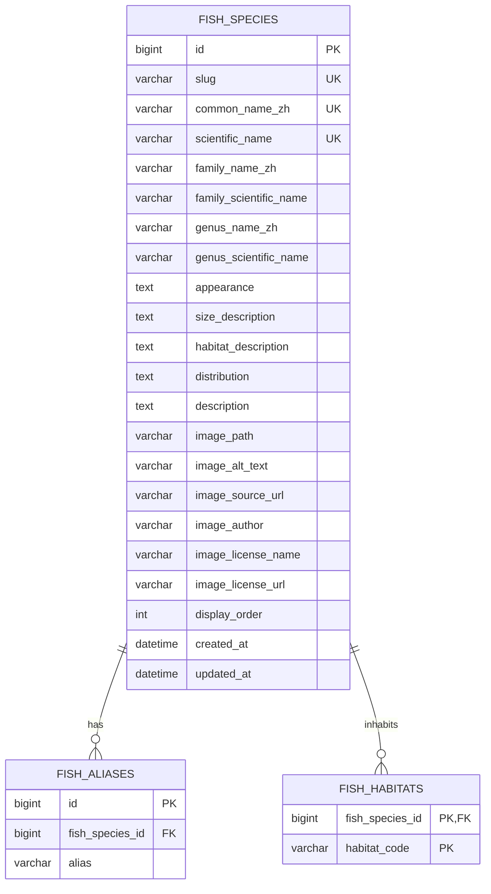

# FishBook 鱼类图鉴核心设计规格

- 日期：2026-08-11
- 状态：设计已由用户逐节确认，等待书面规格复核
- 阶段：FishBook 第二阶段——鱼类图鉴核心
- 架构决策：公开只读目录、适度关系型建模、本地开放许可图片

## 1. 背景与目标

FishBook 第一阶段已经交付工程基础和身份闭环，包括 Spring Boot 后端、React 前端、MySQL/Flyway、Spring Security/Session、Docker、CI 和端到端测试。

第二阶段在现有架构上实现鱼类图鉴核心，让访客无需登录即可浏览、搜索、筛选和阅读中国常见淡水鱼资料。本阶段的学习重点是关系型数据建模、只读查询用例、分页检索、公共 API 安全边界、服务端状态管理和开放许可内容治理。

本阶段完成后，系统应形成以下可用链路：

```text
打开首页 → 浏览鱼类 → 搜索或筛选 → 查看详情 → 查看图片来源和许可证
```

## 2. 产品范围

### 2.1 目标用户

- 不登录的访客：浏览和学习鱼类知识。
- 已登录用户：拥有与访客相同的图鉴读取能力，同时保留现有个人资料能力。
- 后续管理员：未来维护图鉴内容，但不在本阶段实现。

### 2.2 本阶段包含

- 首页展示首批 12 种中国常见淡水鱼。
- 按中文名、别名或科学学名搜索。
- 按科名和栖息环境筛选。
- 查询条件可以组合，条件之间采用 AND 语义。
- 固定每页最多 12 条的分页结果。
- 使用稳定 slug 打开鱼类详情页。
- 展示名称、科学分类、别名、外形、体型、栖息环境、分布、介绍和图片授权信息。
- 将搜索、筛选和页码保存在 URL 中。
- 使用本地开放许可图片，并记录完整来源和许可证。
- 匿名访问公共读取接口，同时继续拒绝图鉴写请求。

### 2.3 本阶段不包含

- 管理员新增、编辑、发布、下架或删除鱼类。
- 图片上传、MinIO 或对象存储接入。
- 收藏、评论、评分和钓获记录。
- 钓法、饵料、季节和钓点建议。
- 外部鱼类运行时 API、自动抓取和 Elasticsearch。
- 多语言、完整生物分类树和内容审核工作流。

这些能力不被否定，只是延后到图鉴读取闭环稳定之后。

## 3. 用户流程与交互规则

### 3.1 浏览流程

1. 访客访问 `/`。
2. 页面加载默认顺序下的首批鱼类，每页最多 12 条。
3. 访客可以输入关键词并按 Enter 或点击“搜索”。
4. 访客可以选择科名或栖息环境；改变搜索或筛选条件时页码回到 `0`。
5. 页面把 `q`、`family`、`habitat` 和 `page` 写入 URL。
6. 访客点击卡片进入 `/fish/{slug}`。
7. 详情页显示完整资料和图片授权信息。
8. 浏览器刷新、前进、后退或分享链接后，页面状态保持可恢复。

### 3.2 页面状态

列表页和详情页必须显式处理：

- 首次加载；
- 查询成功；
- 无匹配结果；
- 请求失败和重试；
- 图片加载失败后的替代区域；
- 单页结果无需分页控件；
- 不存在的 slug；
- 键盘搜索、筛选和详情导航。

## 4. 架构方案决策

### 4.1 采用方案：适度关系型建模

采用一个鱼种主体表、一个别名表和一个栖息环境关联表。单张封面图片的路径与授权元数据作为鱼种主体的一部分保存。

选择原因：

- 别名和栖息环境天然是一对多关系，独立建模后查询和约束清晰。
- 与 MySQL、Flyway 和 JPA 的现有工程结构匹配。
- 足以支持搜索、筛选和后续扩展，又不会提前建立庞大的分类学系统。
- 能训练实体边界、值对象、Repository Port、JPA Adapter 和集成测试。

### 4.2 未采用方案

**单张大表加 JSON 或逗号文本**：实现快，但别名搜索、筛选、约束和维护质量较差。

**完整分类学模型**：把科、属、种、分布、来源和图片全部拆成独立实体，扩展性强，但对 12 种鱼的只读 MVP 属于过度设计。

## 5. 领域模型

### 5.1 FishSpecies 聚合

`FishSpecies` 表示一个鱼种，而不是一条鱼或一次钓获记录。领域对象保持纯 Java，不依赖 JPA 注解。

主要属性：

- `id`：数据库内部标识。
- `slug`：公开且稳定的 URL 标识。
- `commonNameZh`：中文正式名。
- `scientificName`：科学学名。
- `familyNameZh`、`familyScientificName`：中文和拉丁科名。
- `genusNameZh`、`genusScientificName`：中文和拉丁属名。
- `aliases`：别名集合。
- `habitats`：结构化栖息环境集合。
- `appearance`：外形特征。
- `sizeDescription`：自然语言体型说明，避免无可靠依据的伪精确数字。
- `habitatDescription`：更完整的栖息环境说明。
- `distribution`：地理分布。
- `description`：综合介绍。
- `image`：本地路径、替代文本和授权信息组成的值对象。
- `displayOrder`：首版内容的稳定展示顺序。
- `createdAt`、`updatedAt`：审计时间。

### 5.2 Slug 规则

slug 采用小写 ASCII 字母、数字和连字符，首批内容优先由科学学名生成，例如：

```text
Cyprinus carpio → cyprinus-carpio
```

slug 创建后保持稳定。即使未来科学分类名称调整，也不能自动改写已有 slug，避免公开链接失效。

### 5.3 栖息环境代码

首版允许一个鱼种关联多个栖息环境：

| 代码 | 中文标签 |
| --- | --- |
| `RIVER` | 江河 |
| `LAKE` | 湖泊 |
| `RESERVOIR` | 水库 |
| `POND` | 池塘 |
| `STREAM` | 溪流 |

代码用于数据库和 API，中文标签用于界面展示。结构化代码负责筛选，`habitatDescription` 负责准确描述。

## 6. 数据库设计



### 6.1 约束与索引

- `slug`、`common_name_zh` 和 `scientific_name` 分别唯一。
- 同一鱼种内的别名唯一。
- 同一鱼种内的栖息环境代码唯一。
- `display_order` 为正数并具有稳定排序索引。
- 关键名称、说明和图片授权字段不能为空。
- 别名和栖息环境通过外键关联鱼种，并配置级联删除。
- 对正式名、科学学名、科名、别名和栖息环境建立查询所需索引。
- 数据库继续使用 InnoDB、`utf8mb4` 和项目现有校对规则。

### 6.2 Flyway 迁移

- `V3`：创建 `fish_species`、`fish_aliases` 和 `fish_habitats` 及约束。
- `V4`：导入经过核验的 12 种鱼、别名、栖息环境和图片授权元数据。

首批中文名范围固定为：鲫、鲤、草鱼、青鱼、鲢、鳙、乌鳢、鳜、黄颡鱼、团头鲂、翘嘴鲌、泥鳅。科学学名、科属分类和别名必须在编写 `V4` 前逐项核验；如果权威分类采用更新名称，使用核验结果，但不改变这 12 个中文内容主题。

## 7. 后端架构

新增独立 `catalog` 模块，依赖方向保持：

```text
Catalog Controller
→ Catalog Query Service
→ Fish Repository Port
→ JPA Repository Adapter
→ MySQL
```

约束：

- Controller 不直接访问 Spring Data Repository。
- API 不返回 JPA Entity。
- 领域模型不依赖 Web、JPA 或 Spring 注解。
- 查询输入在 Web 边界解析，在应用层再次保护业务边界。
- Repository 查询使用 `EXISTS` 或等价方式匹配别名，避免关联表造成重复结果。
- 分页不能直接对多个集合做 join-fetch；实现需使用投影或分阶段加载，避免重复行和 N+1 查询。
- 本阶段不创建写入应用服务或写 Controller。

## 8. HTTP API

### 8.1 鱼类列表

```http
GET /api/v1/fish?q=鲤&family=鲤科&habitat=LAKE&page=0
```

查询参数：

| 参数 | 规则 |
| --- | --- |
| `q` | 可选；去除首尾空格；空白值视为未提供；最长 100 个字符；匹配中文名、别名和科学学名 |
| `family` | 可选；去除首尾空格；空白值视为未提供；最长 100 个字符；精确匹配中文科名 |
| `habitat` | 可选；必须是已定义栖息环境代码 |
| `page` | 可选；从 `0` 开始；默认 `0`；不得为负数 |

拉丁科学学名匹配不区分大小写；中文搜索使用包含匹配。搜索、科名和栖息环境同时出现时采用 AND。每页大小固定为 12；请求显式传入 `size` 时返回 `400 INVALID_CATALOG_QUERY`，防止客户端绕过固定分页边界。

默认按 `display_order ASC, id ASC` 排序。

响应结构：

```json
{
  "items": [],
  "page": 0,
  "size": 12,
  "totalItems": 12,
  "totalPages": 1
}
```

摘要条目包含 slug、中文名、科学学名、科名、别名、栖息环境、图片路径和替代文本。

### 8.2 筛选选项

```http
GET /api/v1/fish/filters
```

返回数据库中可用的中文科名，以及全部支持的栖息环境代码和中文标签。前端不硬编码科名。

### 8.3 鱼类详情

```http
GET /api/v1/fish/{slug}
```

返回 `FishSpecies` 的完整公开资料、全部别名、栖息环境和图片授权信息。

### 8.4 错误契约

继续复用项目现有统一 JSON 错误格式：

- 参数格式或边界非法：`400 INVALID_CATALOG_QUERY`。
- slug 不存在：`404 FISH_NOT_FOUND`。
- 未预料错误：安全的 `500`，不得泄露 SQL、堆栈或内部实现。

不存在的合法科名返回空结果，不视为参数错误；不存在于枚举中的栖息环境代码返回 `400`。

## 9. 安全边界

只为匿名用户放行：

```text
GET /api/v1/fish
GET /api/v1/fish/**
```

匹配规则必须绑定 HTTP GET 方法。POST、PUT、PATCH 和 DELETE 不得因为路径通配符而被公开，并继续走现有拒绝策略和统一 JSON 错误响应。

现有身份、CSRF、Session Cookie 和 `/api/v1/me` 行为保持不变。

## 10. 前端设计

### 10.1 模块和路由

新增 `frontend/src/features/catalog`，用于隔离类型、API adapter、查询、组件和页面。

```text
/             FishCatalogPage
/fish/{slug}  FishDetailPage
```

现有 `/register`、`/login` 和受保护的 `/profile` 路由保持不变。首页替换当前简单欢迎页，并保留身份相关导航入口。

### 10.2 列表页

页面结构：

1. 标题和图鉴简介；
2. 关键词搜索表单；
3. 科名和栖息环境筛选；
4. 当前条件和清除筛选；
5. 响应式鱼类卡片网格；
6. 分页导航。

卡片显示图片、中文名、科学学名、科名、主要栖息环境和少量别名。图片失败时显示带替代文本的占位区域。

### 10.3 详情页

详情页显示大图、名称、科学分类、全部别名、外形、体型、栖息环境、分布、综合介绍及图片授权。作者、来源页和许可证链接必须靠近图片显示。

### 10.4 状态管理

URL 是搜索、筛选和页码的唯一来源：

```text
/?q=鲤&family=鲤科&habitat=LAKE&page=0
```

React Query 负责服务端数据缓存、加载、失败和重试。查询键必须包含 `q`、`family`、`habitat` 和 `page`，避免不同结果相互污染。

首版采用表单提交触发关键词搜索，不引入输入防抖。改变关键词或筛选器时页码重置为 `0`。

## 11. 图片与内容治理

图片保存到：

```text
frontend/public/images/fish/
```

数据库保存以 `/images/fish/` 开头的同源相对路径。Nginx 作为前端静态资源服务器直接提供图片，后端只返回路径。

每张图片必须满足：

- 来自允许本地保存和再分发的开放许可证或公共领域；
- 记录原始作品页面，而不是只记录图片文件地址；
- 记录作者、许可证名称和许可证链接；
- 遵守署名和相同方式共享等具体要求；
- UI 详情页展示署名；
- 仓库数据来源文档集中登记；
- 授权不明确时不得纳入项目。

文字资料只做基于可靠来源的原创摘要，不复制来源的长篇文字。实施阶段需对 12 种鱼逐项记录分类和内容依据。

## 12. 测试策略

### 12.1 后端

- 领域单元测试：字段规则、slug、图片授权值对象和集合不变量。
- 应用服务测试：查询边界、分页、详情和不存在资源。
- MySQL/Testcontainers 集成测试：V3/V4 迁移、12 种鱼、约束和索引。
- Repository 集成测试：正式名、别名、科学学名、科名、栖息环境、组合条件和分页。
- MockMvc/API 集成测试：列表、筛选、详情和错误契约。
- 安全回归测试：匿名 GET 成功，匿名写请求被拒绝，现有身份接口不回归。

### 12.2 前端

- URL 查询参数解析、规范化和回写。
- API adapter 的查询参数和响应映射。
- 列表、加载、空结果、失败和重试。
- 搜索、筛选、清除条件和分页。
- 详情页及不存在状态。
- 图片授权可见性和图片失败占位。
- React Query 查询键隔离。

### 12.3 端到端

Playwright 通过完整 Docker 环境验证：

1. 匿名访问首页并看到鱼类卡片；
2. 使用别名搜索到正确鱼种；
3. 使用栖息环境筛选；
4. 进入详情页并看到授权信息；
5. 刷新详情页仍然可用；
6. 返回列表后查询条件保持；
7. 现有注册、登录、资料和退出流程继续通过。

## 13. 验收标准

- 数据库恰好导入已定义的 12 种鱼。
- 正式中文名、别名和科学学名搜索全部有效。
- 科名和栖息环境筛选有效，组合查询采用 AND。
- 每页固定最多 12 条，页码和统计信息正确。
- `/` 和 `/fish/{slug}` 支持直接访问和刷新。
- 图鉴 GET API 匿名可用，图鉴写请求没有被开放。
- 每个鱼种的本地图片与授权记录一一对应。
- 图片授权在详情页和仓库文档中都可查。
- 后端、前端和 Playwright 测试全部通过。
- Docker 完整环境中的首页、详情和 API 可用。
- CI 通过，现有身份功能无回归。

## 14. 实施顺序

1. V3 数据库结构与领域模型。
2. Repository Port、JPA Adapter 和查询测试。
3. 查询应用服务、API、错误契约和安全边界。
4. 核验 12 种鱼的资料、图片和许可证，创建 V4 与来源文档。
5. 前端 API adapter、列表页和 URL 查询状态。
6. 详情页、图片授权和可访问性状态。
7. Playwright 鱼类图鉴流程。
8. 后端、前端、Docker、CI 和身份功能全量回归。

所有功能遵循 RED → GREEN → REFACTOR；每个实施任务都必须先定义可观察行为，再写最小实现。

## 15. 风险与控制

| 风险 | 控制措施 |
| --- | --- |
| 鱼类分类或别名不准确 | 导入前逐种核验可靠来源，并在来源文档记录依据 |
| 图片许可证不允许再分发 | 只选择明确开放许可或公共领域素材，保存完整署名链 |
| 别名关联导致分页重复 | Repository 使用 EXISTS、投影或分阶段加载并做真实 MySQL 测试 |
| 公共路径配置过宽 | Security matcher 绑定 GET，并测试所有写方法仍被拒绝 |
| URL 和界面状态分叉 | URL 作为唯一查询状态来源，组件测试前进、后退和刷新 |
| 首次范围扩张到管理后台 | 本阶段不创建写 API、上传系统或管理员页面 |
